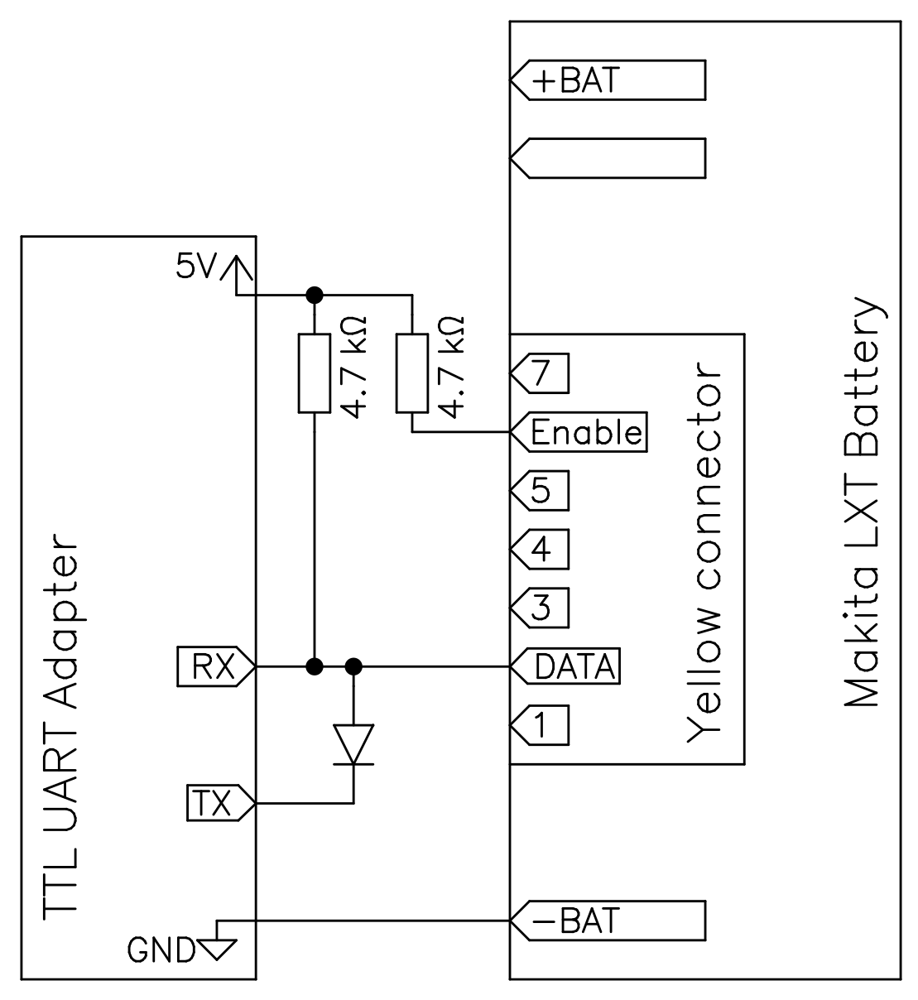

# Notes on how to communicate with Makita 18V batteries

Makita LXT 18V batteries feature various types of battery management systems, that keeps track of cell voltage, temperature, state of charge, overload, undervoltage, which can be read out. This data can be read out through the yellow connector on the batteries.

The [DC18RC](https://www.makitatools.com/products/details/DC18RC) fast charger uses this data connection to figure out the maximum allowed charging current.

The [BTC04](https://www.youtube.com/watch?v=uumwieLu8CE) likewise uses this data connection to display various battery data.

Most of the information here is the result of reverse enginering the BTC04. The rest is from [Martin Jansson's Open Battery Information project](https://github.com/mnh-jansson/open-battery-information).

## Electrical connection

### Yellow connector
Proprietary 8 pin connector with 2.54 mm pitch. Both genders can be sourced from aliexpress.

| Pin | Description                                                                    |
| --- | -------------------------------------------------------------------------------|
|  1  |                                                                                |
|  2  | 1-Wire data                                                                    |
|  3  |                                                                                |
|  4  |                                                                                |
|  5  |                                                                                |
|  6  | Enable (active high)                                                           |
|  7  | *N/C*                                                                          |

Pin 1 is closest to negative battery terminal.

Both pin 2 and 6 are referenced to the negative battery terminal - the rest are probably as well.

Pin 6 must be pulled high (3.3V will do) before and during communication on pin 2. I don't know if it also serves as a open-collector output. It's probably safest to pull up through a 4.7 kiloohm resistor, and it seems to work well enough.

External pull-up on the 1-wire bus on pin 2 must be provided. A 4.7 kiloohm resistor to 3.3V seems to work. Pull-up to 5V should also work.

See also [Martin Jansson's Open Battery Information project](https://github.com/mnh-jansson/open-battery-information) and [this simple hack to use a USB to UART dongle for 1-wire communication](https://github.com/rosvall/uart1wire).

## 1-wire protocol
Standard 1-wire timing seems to work well enough.

Every command is preceeded by a 1-wire reset sequence, to which the battery asserts presence.

Commands that begin with `cc` can alternatively be preceeded by a rom id command  and read (send `33`, receive 8 bytes) instead of just sending `cc`.

## Getting started
It's pretty easy to use a [cheap USB to TTL UART dongle](https://www.digikey.dk/en/products/detail/adafruit-industries-llc/954/7064488) to hack on the batteries with [uart1wire](https://github.com/rosvall/uart1wire).



## Supported commands
Different types of batteries support different sets of commands. Most newer batteries seem to be of type 0, which has the biggest command set.

BTC04 has a somewhat convoluted way of figuring out which battery type it's talking to.

 * [Basic battery info command `cc aa 00`](basic_info_cmd.md)
   I believe all batteries support this command, which returns a bunch of information about type and state. Both that DC18RC charger and BTC04 begins by issuing this command and parsing the results.
 * [Battery type 0 (newest type, probably)](type0.md)
 * [Battery type 2](type2.md)
 * [Battery type 3](type3.md)
 * [Battery type 5 (F0513 based)](type5.md)
 * [Battery type 6 (10 cell, likely BL36xx)](type6.md)

There might also be a type 4, which is 


## Examples of hacking with uart1wire

### Reading rom id and basic battery information
```sh
% ./uart1wire.py /dev/ttyusb0 reset write 33 read 8 write f0 00 read 32
14 0a 12 64 05 05 20 c6
f1 36 b6 c3 18 58 00 00 94 94 40 21 01 80 02 09 43 d0 8e 1b f0 65 00 01 02 02 0e 60 00 40 01 d1
```

### Reading temperature from type 0 battery
Command `cc d7 0e 00 02` responds with a 16 bit little endian integer representing absolute temperature in units of 1/10 K, followed by a byte `0x06`. 

uart1wire supports parsing simple data structures using the standard [python `struct` format strings](https://docs.python.org/3/library/struct.html#format-strings). Instead of giving a length  of 3 bytes to read, we here use a struct format string to describe structure consisting of a little endian short followed by a byte.

```sh
% ./uart1wire.py /dev/ttyUSB0 reset write cc d7 0e 00 02 read '<Hb'
2965 6
```

where 2965 corresponds to 296.5 K = 23.35 °C, and the final 6 means the command succeeded.

### Read model string

```sh
% ./uart1wire.py /dev/ttyUSB0 reset write cc dc 0c read '16s'           
b'BL1850B\x00\x00\x00\x00\x00\x00\x00\x00\x00'
```
Here we use the struct format string `16s` to let uart1wire interpret the received data as a string of 16 bytes. The model name BL1850B followed by null-padding is printed.
